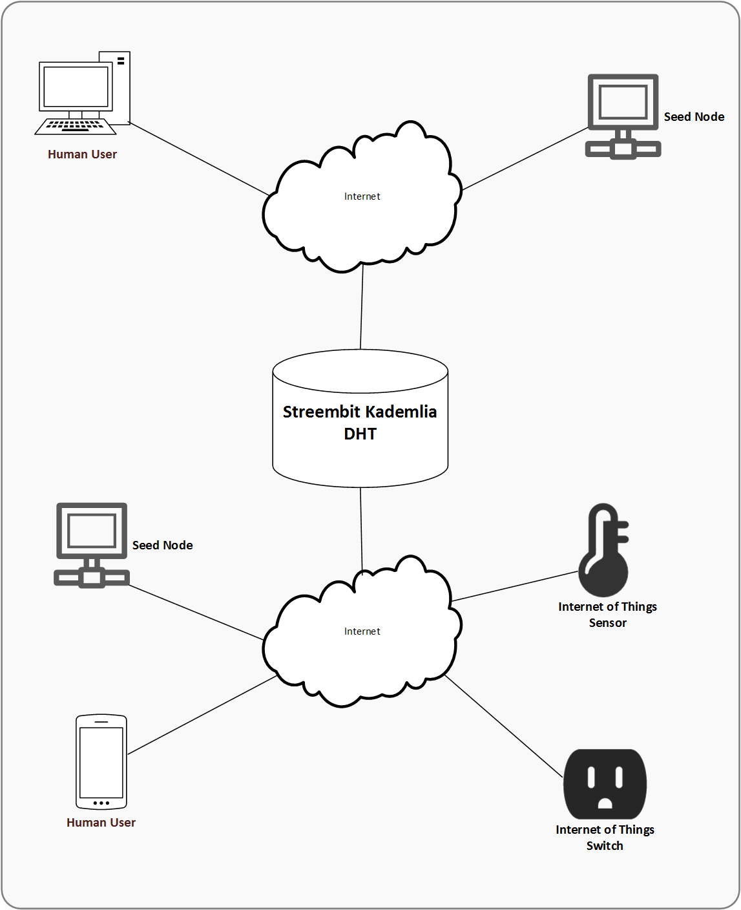

The system forms a decentralized peer to peer overlay network to manage connections between human and Internet of Things peers. The participants in the network are the peer nodes. The peer to peer network is scalable and an unlimited number of nodes can participate in the network.

The system performs public private key infrastructure based authentication and access control functions to securely connect peer nodes. The application generates at least one private/public key pair on each peer node including on the Internet-of-Things devices. The actors of the system publish their public keys to the peer to peer network via a Kademlia distributed hash table (DHT). Each peer node knows the public key of the other connected peer nodes. The system identifies peer nodes in the peer to peer network by their public key. To ensure data integrity the nodes sign the messages with their private key. The nodes sign all messages - there are no unsigned messages circulated in the system. (The requirement for signing the messages also help to mitigate the risks of Sybil attacks and DDoS attacks).

Streembit supports two types of network implementations:

* Public network. Anyone can connect, there is no security gate enabled in the public network. The main Streembit network is public.
* Private network, which implements a security gate to provide only a set of preconfigured contacts with access. A private Streembit network is isolated from the public Streembit network. Only certain peer nodes are allowed to connect to the network. The access control is governed by built in authentication functions. Typically, IoT devices within a building, teams, communities or businesses would run a private Streembit network to establish an even more secure communication mechanism than the public Streembit network. A private Streembit network is functioning as a firewall: only preconfigured contacts allowed to connect. The collection of the preconfigured contacts is maintained in a lookup list. The connection of devices and users which are not in the preconfigured list is refused by the private network.

--------
Check out [other open source projects](https://github.com/zsoltpardi) I have contributed. You can contact me at tzpardi@streembit.com if you have any questions or comments.

