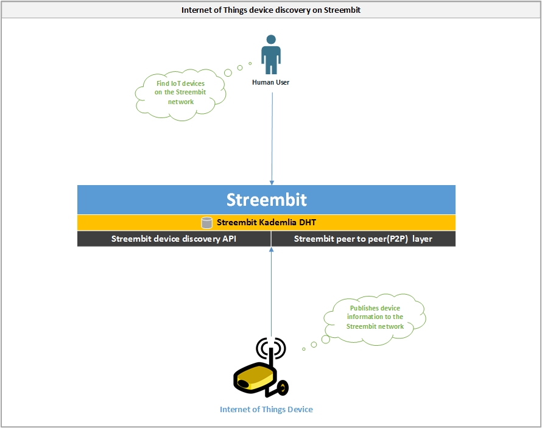
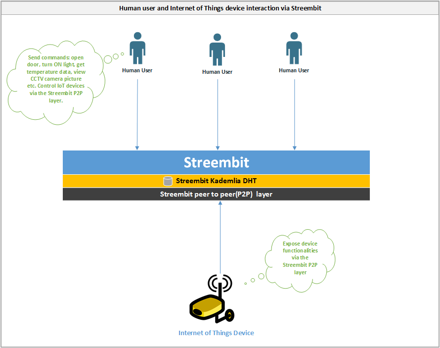

The world of embedded systems has met the Internet and its horde of hackers. The [result is not pretty](http://eandt.theiet.org/magazine/2016/02/internet-of-things-security.cfm). As of writing there is no common, open standard, robust or proven authorization and access control protocol in existence for Internet of Things devices. It is troubling that robust security was not taken into account with the majority of Internet of Things implementations. The data of IoT devices are being harvested in an automated fashion but who has access to the data? What functions can a human or another machine execute on the IoT device? Is my office door actually being opened by a former employee who is not supposed to enter the premise anymore? Is the data being forwarded by the IoT device compromised at all during its way to the end-user, never mind whether or not it was sent by the actual device and not in fact by an intruder?

Streembit manages device discovery as well as authentication, access control and provisioning of devices without using a centralized authority server. The system facilitates device discovery and device control in a peer to peer manner. For many IoT use cases a decentralized, P2P network topology is the most secure, robust, scalable and reliable method of operation. Instead of using expensive corporate owned third party cloud systems, Streembit manages Internet of Things devices without the need of proprietary centralized cloud platforms.  
  Centralized, corporate owned cloud is certainly an easier way to build out IoT platforms. However, the owners and authorities in these topologies all have an influence upon the network and can be exploited. They can ban devices, spy on devices and compromise data integrity of devices. In fact, government can order them to do any or all of these. 
In the near future, the doors of your garage and home, air conditioning units and your home security system will be fully internet connected. You will be able to control your home automation system from your mobile phone. It is essential that only you can control your IoT devices. Streembit excludes third party service and cloud providers from the ecosystem to give full control to the end users over the devices. 

The Streembit IoT implementation is based on [open standards](https://github.com/w3c/web-of-things-framework). The Streembit developers contribute to the standardization process of [W3C Web of Things Interest Group](https://www.w3.org/2000/09/dbwg/details?group=75874&public=1) and mirror all W3C open IoT standards in the Streembit source code.

#### Internet of Things device discovery on Streembit
Streembit allows IoT application providers and context producers to register their IoT Objects on the decentralised Streembit network, and in turn allow context consumers to discover them in a secure and peer to peer manner.

#### Control Internet of Things devices via Streembit
* The Internet of Things devices and human users communicate with each other directly in a peer to peer manner
* The data is end to end encrypted between the human user and IoT device. The encryption key is shared only between the user and device – never with any third parties.
* The device exposes functionalities via the Streembit network and user interface using W3C WoT standards
* The user interacts with the device via the Streembit P2P layer and UI. For example, opening a door, turning ON a light, controlling motor speed, getting temperature data, viewing CCTV pictures etc. all peer to peer, without a centralised solution and via the Streembit user interface. 

#### Upgrade and manage Internet of Things devices via Streembit
* Hardware and software providers upgrade Internet of Things devices on the always up and running Streembit network.
* Internet of Things device manufacturers and software designers publishes firmware and software updates via the Streembit network.
* Internet of Things devices run the Streembit system and ensure the origin and data integrity of the updates by verifying the public key of the publisher.

--------
Check out the [other open source projects](https://github.com/zsoltpardi) I have contributed. You can contact me at tzpardi@streembit.com if you have any questions or comments.
