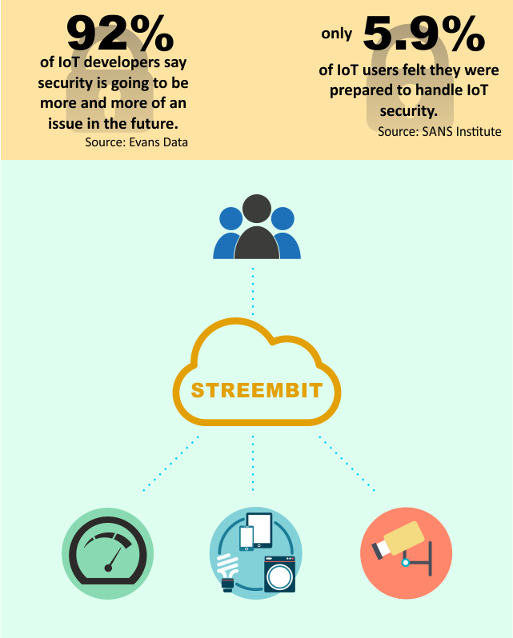

—
layout: post
title: 去中心化 (Decentralized) 的物聯網
subtitle: Decentralized Internet-of-Things
author: “jollen”
categories: article
—

去中心化 (Decentralized) 將是物聯網 (IoT) 佈署的趨勢，你現在正在看的 Streembit 計畫，將會提供一個去中心化物聯網的技術。根據 [Decentralized Internet-of-Things](http://streembit.github.io/2016-05-12-Decentralized-Internet-of-Things/) 的說明：

> Security and discovery are two major system requirements in Internet of Things. Decentralized peer-to-peer computing could address both. 

現有的物聯網面臨二個主要問題：Security 與 Device Discovery。而去中心化與點對點通訊（Peer-to-peer computing）是極佳的解決之道，Streembit 計畫正朝著這個方向發展。

物聯網的裝置間如果想進行通訊，它們必須向特定的伺服器詢問，才能找到「目標裝置」，這個伺服器就扮演統一管理「尋找裝置」的功能，而這個做法，就是典型的中心化（Centralized）架構。

相對的，在一個去中心化的物聯網架構中，裝置間要彼此尋找時，並不需要透過這個中心化的伺服器。要如何實現這個技術呢，Streembit 正提供了一個解決方案。

透過 Streembit 的 P2P 網路，裝置能找到彼此，Streembit 當然也提供了認證（Authentication）功能。這個認證的機制，採用的是 PPKI（Public/private key cryptography）的技術。在 Streembit 網路，以及它的 PPKI 機制上，裝置間得以使用公開金鑰（Public Key）的方式來認證與識別（Identify）。

Streembit 計畫為什麼要發展一個去中心化的 IoT 技術呢，這可以一個簡單的安全議題來說明。中心化伺服器的危險之處，就是如果該伺服器被入侵，或者是資料庫被篡改，整體的物聯網裝置就有潰提的危機。又如，有心人士可以加入一個「偽造」的物聯網裝置到網路上，試想：這裡有一台假的火警裝置正在傳送假的警報給你。

將物聯網的安全管理，交還給所有人（人民），而不是由一個權力機構管理，就能解決安全的問題。這也正是去中心化的意義之一。

———

Check out the [other open source projects](https://github.com/zsoltpardi) I have contributed. You can contact me at tzpardi@streembit.com if you have any questions or comments.
